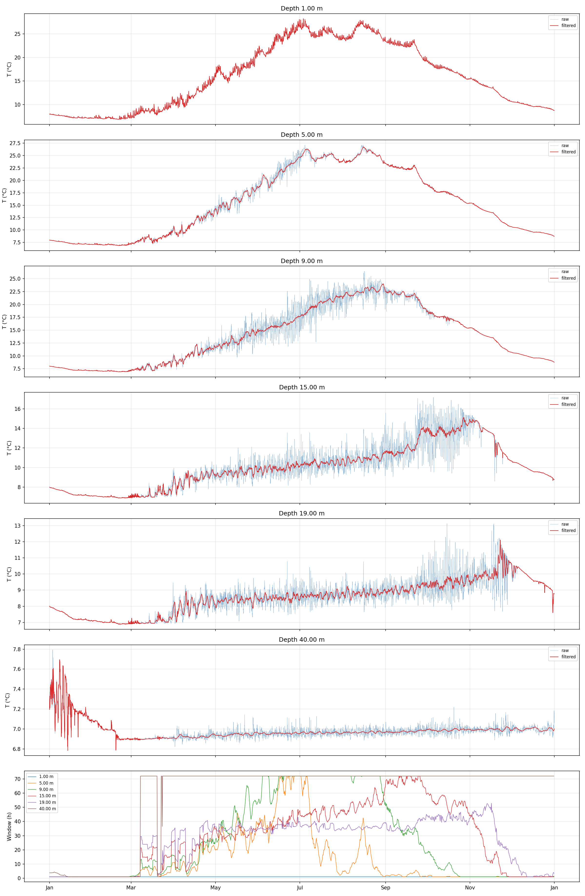

# src — Data Assimilation Pipeline

Ensemble-based lake temperature data assimilation driven by the [Simstrat](https://github.com/Eawag-AppliedSystemAnalysis/Simstrat) 1-D hydrodynamic model.

---

## Directory layout

```
src/
├── main.py                  # parallel ensemble Docker runner
├── ensembles.py             # AR(1) ensemble forcing perturbation
├── copy_standard_inputs.py  # Populate ensemble dirs with shared inputs
├── main_PF.py               # Sequential daily particle filter
├── main_PF_weekly.py        # Same filter with 7-day windows to speed up simulation time and compare
├── main_PF_resampling.py    # Sequential daily particle filter with resampling of likely particles
├── analyze_results.py       # Visualise: raw ensemble spread, PF trajectories and respective RMSE 
└── functions/               # Reusable 
    └── par.py               # overwrite_par_file_dates(): updates only the start/end timestamps
```
---

## Pipeline overview

The workflow described here runs in four stages. Steps 1–2 are needed to prepare inputs; steps 3–4 are the DA loop and anaalysis of results.


**Stage 1 — Input preparation**
  
  Download data: 
  
  Source it from Alplakes, Datalakes, then process and ultimately store in /data directory. 
  In our example we use the temperature observations from the Castagnola buoy (and Gandria sampling only for comparison) as observations.
  For meteorological station values we take the ones from the closest station, namely the LUG station. "Upperlugano" inputs for Simstrat are prepackaged and downloaded from Alplakes.

**Stage 2 — Ensemble generation and input copying**
  
  ensembles.py                        → Fit AR(1) to obs–reanalysis residuals → 20 perturbed Forcing.dat files
  
  copy_standard_inputs.py             → Copy all non-forcing inputs into ensemble0–20/

Make sure that the modelled times correspond to observation times. For hourly assimilation you need to change the Setting.par file in the standard inputs accordingly before copying all to the ensemble repositories (see below...).

(../images/par_mod.png)

**Stage 3 — Simulation + assimilation**  

  main.py / main_PF.py / main_PF_weekly.py / main_PF_resampled
  
  Generate free ensemble runs 
  
  and/or

  Run daily (or weekly) assimilation loop:

  1. Run 21 Docker containers (ensemble0–20) in parallel for the window

  2. Compute per-member RMSE vs in-situ observations

  3. Copy best member's snapshot to all others/resample from the most likely states  ← particle filter step
  
  4. Accumulate trajectories potentially useable for reanalysis/forecast mode (best member, ensemble mean, persistence member)

**Stage 4 — Analysis**
  
  analyze_results.py    
  
  Three figures currently generated:

  Fig 1 — Temperature fan (ensemble spread) at 6 depths vs Castagnola and Gandria obs,
          overlaid with ensemble0 control, daily best (hindsight), ensemble mean, and persistence
          
  Fig 2 — Stacked RMSE bar chart per member ranked by total RMSE, highlighting
          ensemble0 and best perturbed member. Used to have a look at the free ensemble predicions.

  Fig 3 — RMSE comparison across trajectory types (standard, weekly/daily best,
          ensemble mean, persistence) with % gain relative to ensemble0 → This is the final product to asses the performance


---

## Running the pipeline

### Prerequisites

- Docker daemon running (`eawag/simstrat:3.0.4` image available)
- Python dependencies: `numpy pandas matplotlib scipy netCDF4 pylake statsmodels tqdm`

### Step 1 — Prepare standard inputs

Use [Alplakes](https://www.alplakes.eawag.ch/downloads) and [Datalakes](https://www.datalakes-eawag.ch/data) and manually provide.

Data retrieval will be automated in future iterations.

### Step 2 — Generate ensemble forcing and copying inputs

```bash
python src/ensembles.py
python src/copy_standard_inputs.py
```
`ensembles.py` expects:
- `data/obs_2025.csv` — observed hourly meteorology (time, wind speed/dir, T, radiation, RH, precip, vapour pressure, cloud cover)
- `data/lake_mean_ICON_2025.csv` — ICON reanalysis (average over the lake) for the same period for the variables to perturb

Outputs: `assimilation/upperlugano/ensemble{0..20}/Forcing.dat` + other unchanged files.


**Column 1:** All three residual series show the classic geometric decay of an AR(1) process, and the red AR(1) fits with φ = 0.66 (U), 0.69 (V), 0.49 (GLOB) sitting on top of the empirical ACF for at least the first ~12 lags. AR(1) captures the dominant short-memory structure well. However, the ACFs show a clear bump around lag ~24, with smaller secondary humps at ~48. That's a diurnal cycle periodicity that AR(1) is not capturing.

**Column 2:** Single dominant spike at lag 1, everything else remains inside or close to the noise band. This confirms that adding an AR(2) or higher-order term would help very little and that the leftover structure is seasonal, not higher-order autoregressive. Ideas to fix this could be adding a seasonal/diurnal term (e.g. SARIMA(1,0,0)(1,0,0)₂₄, or a harmonic regression on hour-of-day before fitting AR).

**Column 3:** U and V are roughly Gaussian and the N(0, σ²) overlay is reasonable, though U has a noticeably heavier right tail. GLOB is more problematic because there's a huge spike at zero. This is the night-time effect; when observed radiation is 0, the the residual must be exactly 0. The fast solution at the moment is to clip the residuals at 0 when GLOB is 0.

**Column 4**: Visually well-behaved spread of the ensembles.

### Step 3 — Run the particle filter

```bash
python src/main_PF.py             # daily windows --> best-member selection filter 
python src/main_PF_weekly.py      # 7-day windows --> best-member selection filter
python src/main_PF_resampling.py  # daily updates + resampling of likely particles --> weights particles by likelihood and resamples probabilistically
python src/main_EnKF.py           # daily windows --> EnKF update (see below)

```


Deterministic Filtering no (Bayesian) weighting, resampling, or covariance updates --> just the daily winner state copied

Key constants at the top of each file:

| Constant | Description |
|---|---|
| `ENSEMBLE_BASE` | Path to the `assimilation/<lake>/` directory |
| `OBS_PATH` | In-situ temperature observations CSV (`time`, `depth`, `value`) |
| `N_MEMBERS` | Number of perturbed ensemble members (default 20) |
| `PF_RESULTS` | Output subdirectory inside each ensemble dir (default `Results_PF`) |

Set `reset=True` on the first run to clear any stale snapshots and trajectory files prior to running a new assimilation.

## ENKF Implementation in main_EnKF.py

This script implements a stochastic Ensemble Kalman Filter (EnKF) for assimilating lake temperature observations into a multi-member Simstrat ensemble simulation. Each day, all ensemble members are propagated forward in parallel using persistent Docker containers, after which the temperature state vectors are extracted directly from the live Simstrat snapshot files. The ensemble forecast matrix is constructed from the vertical temperature profiles of all ensemble members, where `n_x` is the number of model cells and `N` is the ensemble size. Observations are aggregated over the assimilation window and mapped to the model grid through a linear observation operator `H`, which selects the nearest model layer corresponding to each observation depth. 

The EnKF estimates the forecast covariance from the ensemble anomalies:

```math
A = X_f - \bar{x}_f
```

which can optionally be inflated by a multiplicative factor to avoid ensemble collapse. The Kalman gain is then computed as:

```math
K = P^f H^T (H P^f H^T + R)^{-1}
```

where `R` is the observation error covariance matrix. A stochastic EnKF update is applied independently to each ensemble member according to:

```math
x_a^{(i)} = x_f^{(i)} + K \left( y_o + \varepsilon_i - Hx_f^{(i)} \right)
```

with:

```math
\varepsilon_i \sim \mathcal{N}(0,R)
```

representing perturbed observations. The updated temperature profiles are written back into the Simstrat snapshot files, allowing the simulation to continue from the assimilated state while preserving ensemble spread and dynamically estimated uncertainty structures.

**Comment:**
1. Inflation makes it a modified prior system
2. Observation errors assumed independent (diagonal R)
3. This is a perturbed-observation EnKF, not deterministic EnKF
4. Sample covariance approximations are standard but noisy for small ensemble size (N)

---

## Free parameters and sensitivity

### Observation pre-processing (`adaptive_filter_general.py`)

Controls how much high-frequency variability is removed from the raw buoy signal before it enters either filter. The adaptive window is the sum of a gradient-driven component (thermocline) and a depth-floor component (below thermocline).

| Parameter | Default | Unit | Effect |
|---|---|---|---|
| `W_MIN` | 1.0 | h | Floor of the filter window — sets the minimum smoothing applied at all depths and times |
| `W_MAX` | 72 | h | Ceiling of the filter window — caps smoothing at the peak thermocline gradient |
| `W_DEEP` | 72.0 | h | Window applied at `DEEP_REF` by the depth-floor component; controls smoothing in the hypolimnion |
| `DEEP_REF` | 40.0 | m | Depth at which the depth-floor component reaches `W_DEEP`; adjusting this scales how aggressively deep layers are smoothed |
| `G_MAX` | `None` (auto → 95th pct) | °C/m | Gradient value that maps to `W_MAX`; when `None` the 95th percentile of observed thermocline gradients is used — a higher manual value reduces smoothing near the thermocline |
| `GRAD_SMOOTH_H` | 72 | h | Rolling window used to smooth the gradient signal before computing window widths — larger values add inertia to the window response |
| `THERMO_DEPTH_MIN` | 4.0 | m | Depths shallower than this are excluded from the gradient calculation to avoid surface-heating artefacts driving the window |
| `THERMO_GRAD_MIN` | 0.1 | °C/m | Minimum peak gradient required to activate the depth-floor component — raise this to suppress deep smoothing during weakly stratified (e.g. winter) periods |
| `DT_FILT` | 60 | min | Temporal resolution of the filter — coarser resolution reduces cost but limits retention of sub-hourly variability |

### Common DA settings (`main_PF_fast.py` and `main_EnKF.py`)

| Parameter | Default | Unit | Effect |
|---|---|---|---|
| `N_MEMBERS` | 20 | — | Ensemble size — larger ensembles give a better covariance estimate but increase runtime proportionally |
| `OBS_TO_SIM_DEPTH` | `{0.5: 0}` | m | Remaps near-surface obs to the surface model layer; extend this dict if sensor depths do not align with model grid cells |
| Assimilation window | 1 day | — | Frequency of DA updates — shorter windows correct more frequently but are sensitive to sparse or noisy obs |
| `reset` | `True` | — | If `True`, clears live snapshots and trajectory files and bootstraps from the latest dated snapshot; set `False` to resume a run |

### Particle filter–specific (`main_PF_fast.py`)

| Parameter | Default | Unit | Effect |
|---|---|---|---|
| Depth-weighted RMSE (Voronoi) | enabled | — | Weights obs depths by their vertical representativeness (Voronoi cell width in metres); a sensor spanning a 5 m gap contributes 5× more than one in a 1 m gap |
| Selection strategy | best-member copy | — | Deterministic winner-takes-all: the single member with the lowest weighted RMSE has its snapshot copied to all others — the entire ensemble collapses to one state each day obs are available |

### EnKF-specific (`main_EnKF.py`)

| Parameter | Default | Unit | Effect |
|---|---|---|---|
| `SIGMA_OBS` | 0.5 | °C | Observation error std — larger values reduce the weight given to observations; the ensemble is trusted more relative to the obs |
| `INFLATION` | 1.05 | — | Multiplicative anomaly inflation applied before the Kalman update — counteracts ensemble collapse; too small leads to filter divergence, too large introduces spurious spread |
| Obs aggregation | temporal mean over window | — | Observations are averaged over the daily window before the update — reduces noise but discards sub-daily variability; could be replaced by time-matched instantaneous obs |
| Stochastic perturbations `εᵢ ~ N(0, R)` | enabled | — | Perturbed-observations EnKF — adds random noise to each member's obs draw to preserve post-analysis spread; an alternative is the deterministic ETKF (no perturbations, lower sampling noise) |

**Key levers for sensitivity experiments:** `SIGMA_OBS` and `INFLATION` have the largest impact on EnKF skill; `W_MAX` and `G_MAX` determine how much high-frequency signal survives into the DA observation vector; `N_MEMBERS` jointly affects both PF and EnKF skill vs. computational cost.

---

### Step 4 — Analyse results

```bash
python src/analyze_results.py  
```


The image shows the improvements against Castagnola observations during 2025 with different methods of assimilation of the buoy measurments based on the particle filter theory. Right now the best performing method is a simple selection of the best performing state at each window iteration with general improvements over the full temperature profile of up to ~30%,

---

## How snapshots pass state between windows

Simstrat writes `Results_PF/simulation-snapshot.dat` at the end of every run. Between windows:

1. `*_out.dat` files are deleted; the snapshot is left in place.
2. Simstrat detects the snapshot and restarts from it automatically.
3. After the RMSE evaluation based on pooled Root Mean Squared Error (RMSE) (over both time (within a window) and depths), `_copy_best_to_all()` overwrites every member's snapshot with the best member's or a resampled likely state — this is the particle filter resampling step.

On the very first window, a pre-generated dated snapshot (`simulation-snapshot_YYYYMMDD.dat` in the ensemble root) is used as the bootstrap state. Note that this was generated using a standard Simstrat run from 1981 up until 31.12.2024 (model spin up).

---

## Open questions and challenges 
1. How can we make the assimilation faster?

`main_PF_fast.py` implements five optimisations over the original `main_PF.py`. Each one targets a different bottleneck in the daily loop.

**1. Persistent Docker containers** (`_start_containers`, line 96 — `_run_one_window`, line 183)

The naive approach calls `docker run` for every member on every day, which takes 1–2 s just to boot the container — before Simstrat even starts. `main_PF_fast.py` instead starts one container per member at the beginning of the entire run (`docker run … sleep infinity`) and then uses `docker exec` for each daily window. The container stays alive and ready; only the par file dates are patched between calls. For 20 members × 365 days this avoids ~7 300 cold starts.

*Why it is safe:* each container mounts only its own ensemble directory and writes only to its own `Results_PF/` subdirectory, so concurrent containers can never overwrite each other's files.

**2. All members run in parallel per day** (`_run_window_parallel`, line 190)

Rather than running member 1, waiting for it to finish, then running member 2, etc., all 20 `docker exec` calls are submitted at once to a `ThreadPoolExecutor`. The wall-clock time per day becomes the time of the *slowest* member, not 20× the time of one member.

*Why it is safe:* the 20 Simstrat processes are completely independent — they read different input files and write to different output directories. Python threads are used only to dispatch subprocesses; the GIL is not an issue here because the work happens inside the container processes, not in Python.

**3. Parallel RMSE scoring** (`_load_and_score` inside `run_pf_daily`, line 475)

After all containers finish, the 20 `T_out.dat` files are loaded and scored against observations concurrently in another `ThreadPoolExecutor`, so file I/O for all members overlaps.

*Why it is safe:* each thread reads a different file and writes only to a local variable; no shared mutable state exists between threads, so there is no risk of one thread corrupting another's result.

**4. Vectorised RMSE** (`_rmse_in_window`, line 251)

The original code looped over each depth in Python to accumulate squared errors. The fast version pivots both the simulation and observation data into `(time × depth)` NumPy matrices and computes the entire weighted RMSE in two matrix operations (`sq_err * w_mat`), eliminating the inner Python loop.

*Why it is safe:* this is a pure arithmetic refactor — the formula is identical to the loop version, just expressed as matrix operations. NumPy operates on copies of the data (`sim_vals`, `obs_vals`) extracted from the DataFrames, so the original data is never modified.

**5. Exact depth lookup dict** (`OBS_TO_SIM_DEPTH`, line 88)

Mapping an observation depth to the nearest model grid column used to call `np.argmin(np.abs(...))` at every depth and every timestep. A pre-built dictionary (`{obs_depth: sim_col}`) turns this into a single hash lookup with no array scan.

*Why it is safe:* the dictionary is built once before the loop from the full set of unique observation depths, so every depth that appears during the run is guaranteed to be present. The fallback `dict.get(d, -d)` in `_obs_to_sim_col` means an unmapped depth silently maps to its negative value, which is the same convention the rest of the code uses for depths measured downward from the surface.

2. How can we assimilate highly variable temperature timeseries around the thermocline and below?

We develop an adaptive low-pass filter whose window size varies with both depth and time, based on stratification strength. The window at each depth and timestep is the sum of two components.

**Step 0 — Gradient smoothing**

Raw local gradients are first smoothed with a causal `GRAD_SMOOTH_H`-hour trailing mean (parameter $W_s$) to reduce noise before driving the window:

```math
\bar{g}(z,t) = \frac{1}{W_s}\int_{t-W_s}^{t} \left|\frac{\partial T}{\partial z}(z,\tau)\right| d\tau
```

Depths shallower than `THERMO_DEPTH_MIN` are set to zero (surface layer dominated by solar heating, not internal waves).

**Component 1 — Gradient-driven (thermocline)**

```math
W_\text{grad}(z,t) = \text{clip}\!\left(\frac{W_\text{MAX} \cdot \bar{g}(z,t)}{G_\text{MAX}},\ W_\text{MIN},\ W_\text{MAX}\right)
```

`G_MAX` is the gradient value that maps to `W_MAX` (default: 95th percentile of $\bar{g}$ across thermocline depths, auto-computed).

**Component 2 — Depth floor (below thermocline)**

```math
W_\text{floor}(z,t) = \text{clip}\!\left(\frac{z - z_{tc}(t)}{\max\!\left(D_\text{ref} - z_{tc}(t),\; 1\right)},\ 0,\ 1\right) \cdot (W_\text{DEEP} - W_\text{MIN})
```

where $z_{tc}(t) = \arg\max_z \bar{g}(z,t)$ is the time-varying thermocline depth (depth of peak smoothed gradient). This component is zero when the peak gradient falls below `THERMO_GRAD_MIN` (no active stratification, e.g. winter). The $\max(\cdot, 1)$ in the denominator guards against division by zero when $z_{tc} \geq D_\text{ref}$.

**Final window**

```math
W(z,t) = \text{clip}\!\left(W_\text{grad}(z,t) + W_\text{floor}(z,t),\ W_\text{MIN},\ W_\text{MAX}\right)
```

| Zone | Dominant component | Typical window |
|---|---|---|
| $z <$ `THERMO_DEPTH_MIN` | none ($\bar{g} = 0$ forced) | $W_\text{MIN}$ |
| thermocline | $W_\text{grad}$ | up to $W_\text{MAX}$ |
| below thermocline | $W_\text{floor}$ ramps with depth | $W_\text{MIN}$ → $W_\text{DEEP}$ |

Applied as a causal trailing box filter (no lookahead, online-compatible).



raw hourly temperature in thin transparent blue against the adaptively
filtered signal in red. The gap between the two lines represents the high-frequency variability the filter removed at
that depth — narrow near the surface (short window, little smoothing), wider near and below the thermocline (longer
window, more aggressive smoothing). The last plot makes the seasonal behaviour of the filter directly visible — windows grow during summer
stratification (strong thermocline gradient activates both the gradient-driven and depth-floor components) and collapse
toward W_MIN in winter when the water column is well-mixed

3. Can the forcing perturbation be improved to account for daily cycle at least for wind?
4. Can resampling improve the filtering?
5. Currently using RMSE across depths without weights, is there a better objective?

`main_PF_fast.py` now uses a **depth-weighted RMSE** where each obs depth is weighted by its Voronoi cell width — half the distance to its nearest neighbours — so that a sensor spanning a larger depth interval contributes proportionally more to the score:

```math
w_d = \begin{cases}
\dfrac{z_2 - z_1}{2} & d = 1 \text{ (shallowest)} \\[6pt]
\dfrac{z_{d+1} - z_{d-1}}{2} & 1 < d < D \\[6pt]
\dfrac{z_D - z_{D-1}}{2} & d = D \text{ (deepest)}
\end{cases}
```

The pooled score over all matched obs times $t$ and depths $d$ within the daily window is then:

```math
\text{RMSE} = \sqrt{\frac{\displaystyle\sum_{t,\,d} w_d \cdot \bigl(T_\text{sim}(t,d) - T_\text{obs}(t,d)\bigr)^2}{\displaystyle\sum_{t,\,d} w_d}}
```

For uniformly spaced 1 m sensors every $w_d = 1$ and this reduces to the plain RMSE. For the Castagnola buoy, gaps between sensors widen below the thermocline, so deep sensors receive higher weight and the best-member selection is not dominated by the densely sampled surface layer. The EnKF does not yet apply equivalent depth weighting — all obs depths currently enter with the same `SIGMA_OBS`.
