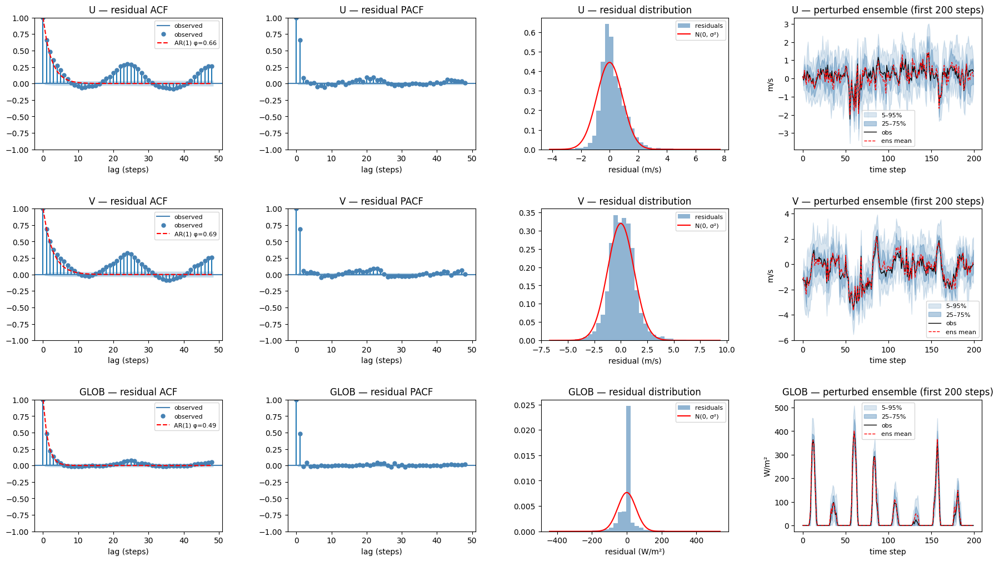
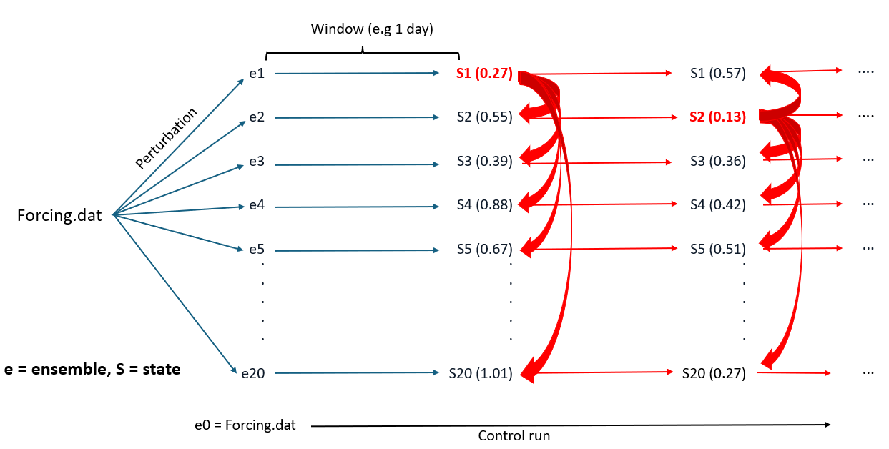
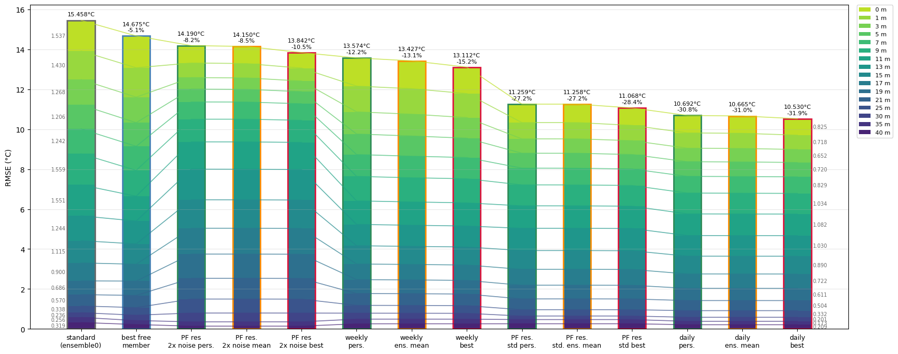

# src — Data Assimilation Pipeline

Ensemble-based lake temperature data assimilation driven by the [Simstrat](https://github.com/Eawag-AppliedSystemAnalysis/Simstrat) 1-D hydrodynamic model.

---

## Directory layout

```
src/
├── main.py                  # parallel ensemble Docker runner
├── ensembles.py             # AR(1) ensemble forcing perturbation
├── copy_standard_inputs.py  # Populate ensemble dirs with shared inputs
├── main_PF.py               # Sequential daily particle filter
├── main_PF_weekly.py        # Same filter with 7-day windows to speed up simulation time and compare
├── main_PF_resampling.py    # Sequential daily particle filter with resampling of likely particles
├── analyze_results.py       # Visualise: raw ensemble spread, PF trajectories and respective RMSE 
└── functions/               # Reusable 
    └── par.py               # overwrite_par_file_dates(): updates only the start/end timestamps
```
---

## Pipeline overview

The workflow described here runs in four stages. Steps 1–2 are needed to prepare inputs; steps 3–4 are the DA loop and anaalysis of results.


**Stage 1 — Input preparation**
  
  Download data: 
  
  Source it from Alplakes, Datalakes, then process and ultimately store in /data directory. 
  In our example we use the temperature observations from the Castagnola buoy (and Gandria sampling only for comparison) as observations.
  For meteorological station values we take the ones from the closest station, namely the LUG station. "Upperlugano" inputs for Simstrat are prepackaged and downloaded from Alplakes.

**Stage 2 — Ensemble generation and input copying**
  
  ensembles.py                        → Fit AR(1) to obs–reanalysis residuals → 20 perturbed Forcing.dat files
  
  copy_standard_inputs.py             → Copy all non-forcing inputs into ensemble0–20/

Make sure that the modelled times correspond to observation times. For hourly assimilation you need to change the Setting.par file in the standard inputs accordingly before copying all to the ensemble repositories (see below...).

(../images/par_mod.png)

**Stage 3 — Simulation + assimilation**  

  main.py / main_PF.py / main_PF_weekly.py / main_PF_resampled
  
  Generate free ensemble runs 
  
  and/or

  Run daily (or weekly) assimilation loop:

  1. Run 21 Docker containers (ensemble0–20) in parallel for the window

  2. Compute per-member RMSE vs in-situ observations

  3. Copy best member's snapshot to all others/resample from the most likely states  ← particle filter step
  
  4. Accumulate trajectories potentially useable for reanalysis/forecast mode (best member, ensemble mean, persistence member)

**Stage 4 — Analysis**
  
  analyze_results.py    
  
  Three figures currently generated:

  Fig 1 — Temperature fan (ensemble spread) at 6 depths vs Castagnola and Gandria obs,
          overlaid with ensemble0 control, daily best (hindsight), ensemble mean, and persistence
          
  Fig 2 — Stacked RMSE bar chart per member ranked by total RMSE, highlighting
          ensemble0 and best perturbed member. Used to have a look at the free ensemble predicions.

  Fig 3 — RMSE comparison across trajectory types (standard, weekly/daily best,
          ensemble mean, persistence) with % gain relative to ensemble0 → This is the final product to asses the performance


---

## Running the pipeline

### Prerequisites

- Docker daemon running (`eawag/simstrat:3.0.4` image available)
- Python dependencies: `numpy pandas matplotlib scipy netCDF4 pylake statsmodels tqdm`

### Step 1 — Prepare standard inputs

Use [Alplakes](https://www.alplakes.eawag.ch/downloads) and [Datalakes](https://www.datalakes-eawag.ch/data) and manually provide.

Data retrieval will be automated in future iterations.

### Step 2 — Generate ensemble forcing and copying inputs

```bash
python src/ensembles.py
python src/copy_standard_inputs.py
```
`ensembles.py` expects:
- `data/obs_2025.csv` — observed hourly meteorology (time, wind speed/dir, T, radiation, RH, precip, vapour pressure, cloud cover)
- `data/lake_mean_ICON_2025.csv` — ICON reanalysis (average over the lake) for the same period for the variables to perturb

Outputs: `assimilation/upperlugano/ensemble{0..20}/Forcing.dat` + other unchanged files.



**Column 1:** All three residual series show the classic geometric decay of an AR(1) process, and the red AR(1) fits with φ = 0.66 (U), 0.69 (V), 0.49 (GLOB) sitting on top of the empirical ACF for at least the first ~12 lags. AR(1) captures the dominant short-memory structure well. However, the ACFs show a clear bump around lag ~24, with smaller secondary humps at ~48. That's a diurnal cycle periodicity that AR(1) is not capturing.

**Column 2:** Single dominant spike at lag 1, everything else remains inside or close to the noise band. This confirms that adding an AR(2) or higher-order term would help very little and that the leftover structure is seasonal, not higher-order autoregressive. Ideas to fix this could be adding a seasonal/diurnal term (e.g. SARIMA(1,0,0)(1,0,0)₂₄, or a harmonic regression on hour-of-day before fitting AR).

**Column 3:** U and V are roughly Gaussian and the N(0, σ²) overlay is reasonable, though U has a noticeably heavier right tail. GLOB is more problematic because there's a huge spike at zero. This is the night-time effect; when observed radiation is 0, the the residual must be exactly 0. The fast solution at the moment is to clip the residuals at 0 when GLOB is 0.

**Column 4**: Visually well-behaved spread of the ensembles.

### Step 3 — Run the particle filter

```bash
python src/main_PF.py             # daily windows --> best-member selection filter 
python src/main_PF_weekly.py      # 7-day windows --> best-member selection filter
python src/main_PF_resampling.py  # daily updates + resampling of likely particles --> weights particles by likelihood and resamples probabilistically
```


Deterministic Filtering no (Bayesian) weighting, resampling, or covariance updates --> just the daily winner state copied

Key constants at the top of each file:

| Constant | Description |
|---|---|
| `ENSEMBLE_BASE` | Path to the `assimilation/<lake>/` directory |
| `OBS_PATH` | In-situ temperature observations CSV (`time`, `depth`, `value`) |
| `N_MEMBERS` | Number of perturbed ensemble members (default 20) |
| `PF_RESULTS` | Output subdirectory inside each ensemble dir (default `Results_PF`) |

Set `reset=True` on the first run to clear any stale snapshots and trajectory files prior to running a new assimilation.

### Step 4 — Analyse results

```bash
python src/analyze_results.py  
```



The image shows the improvements against Castagnola observations during 2025 with different methods of assimilation of the buoy measurments based on the particle filter theory. Right now the best performing method is a simple selection of the best performing state at each window iteration with general improvements over the full temperature profile of up to ~30%,

---

## How snapshots pass state between windows

Simstrat writes `Results_PF/simulation-snapshot.dat` at the end of every run. Between windows:

1. `*_out.dat` files are deleted; the snapshot is left in place.
2. Simstrat detects the snapshot and restarts from it automatically.
3. After the RMSE evaluation based on pooled Root Mean Squared Error (RMSE) (over both time (within a window) and depths), `_copy_best_to_all()` overwrites every member's snapshot with the best member's or a resampled likely state — this is the particle filter resampling step.

On the very first window, a pre-generated dated snapshot (`simulation-snapshot_YYYYMMDD.dat` in the ensemble root) is used as the bootstrap state. Note that this was generated using a standard Simstrat run from 1981 up until 31.12.2024.

---

## Open questions and challenges 
1. How can we assimilate highly variable temperature timeseries around the thermocline and below?

We develope an adaptive filter to apply a low pass filter based on stratification and depth.
The filter window-size (x hours) at each depth and timestep is the sum of two components:

  1. Temperature gradient-driven (thermocline signal):
       W_grad(z,t) = clip(W_MAX * |dT/dz(z,t)| / G_MAX,  W_MIN, W_MAX)
     - |dT/dz| is computed from a 72-h trailing mean of the local gradient
     - Depths shallower than THERMO_DEPTH_MIN are excluded (surface heating dominant, we assume that these depths are not influenced significantly thermocline internal waves)

  2. Depth floor (stability below thermocline):
       W_floor(z,t) = clip((z - z_tc(t)) / (DEEP_REF - z_tc(t)), 0, 1) * (W_DEEP - W_MIN)
     where z_tc(t) = depth of maximum |dT/dz| at time t (time-varying thermocline depth)
     - Zero everywhere when peak gradient < THERMO_GRAD_MIN (no thermocline, e.g. winter)
     - Zero at and above z_tc; ramps linearly to W_DEEP at DEEP_REF when active

  Final window:
       W(z,t) = clip(W_grad(z,t) + W_floor(z),  W_MIN, W_MAX)

  Zone summary:
    surface  (z < THERMO_DEPTH_MIN)  → W_MIN only  (solar heating, not internal waves)
    thermocline                       → dominated by W_grad, up to W_MAX
    below thermocline                 → W_floor increases with depth, W_grad small

  Applied as a causal trailing box filter (no lookahead, online-compatible option).

2. Can the forcing perturbation be improved to account for daily cycle at least for wind?
3. Can resampling improve the filtering?
4. Currently using RMSE across depths without weights, is there a better objective?
